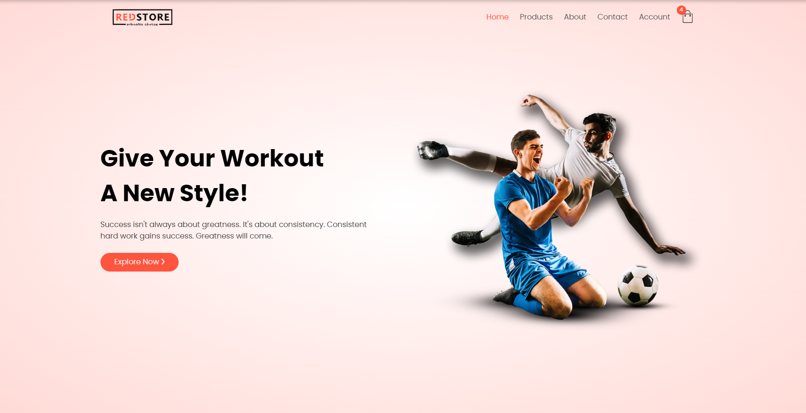

# Redstore - Ecommerce Website

This repository holds code for the ecommerce practice project website. The design has been copied from an [online HTML & CSS tutorial](https://www.youtube.com/watch?v=yQimoqo0-7g&t=0s). 

## Screenshot

## Features

- All products are stored in [mockapi.io](https://mockapi.io/)
- View all products on "Products" page and sort as you wish. Either by name, rating, price or date (ascending or descending)

## Built with

- [React](https://react.dev/)
- [Sass](https://sass-lang.com/)
- [styled-components](https://styled-components.com/)
- [Vite](https://vitejs.dev/)

## Author

- [Github](https://github.com/boristenkes/)
